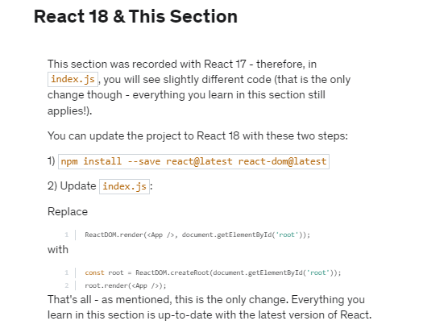

>   const inputState = ueState({ title: "", amount: "" });

- inputState[1] (used to update state replaces state so if you want to update a single property like so: onChange={(event) => inputState[1]({ title: event.target.value })}  ) you need to provide the value of amount as well or you will loose the value of that property. 

- In class based components state has to be an object and react does merge it for you, but in functional components state can be anything and you have to merge it yourself.
